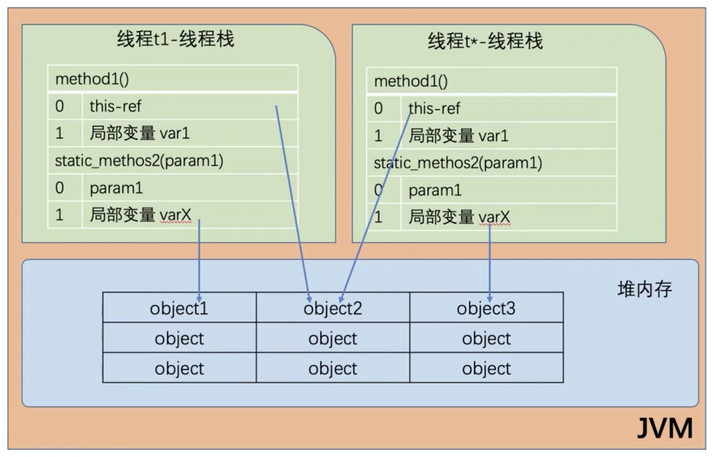
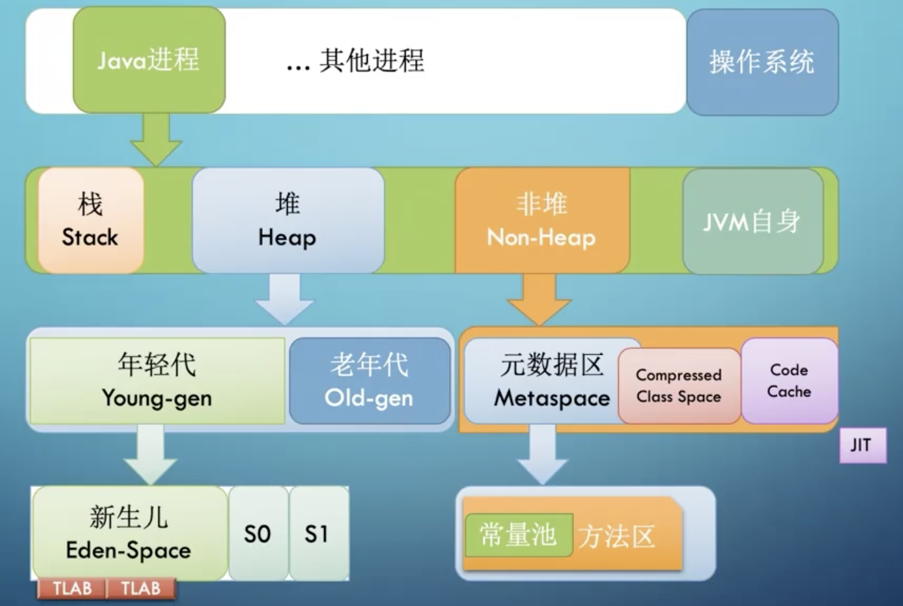
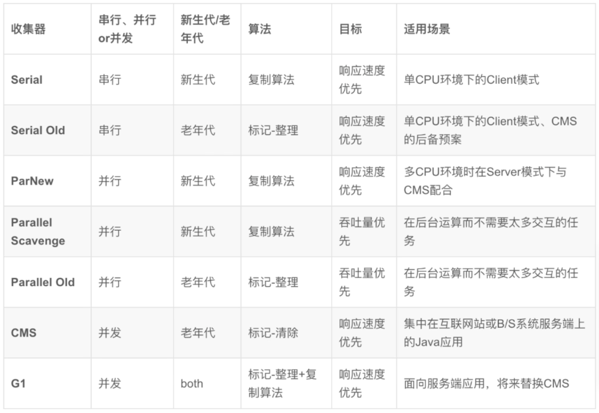

# JVM核心技术

## 字节码

Java bytecode 由单字节（byte）指令构成，理论上最多支持256个操作码，实际只用了200左右。

分类：

- 栈操作指令
- 程序流程控制指令
- 对象操作指令（包括方法调用指令）
- 算术运算以及类型转换指令

查看字节码

```java
public class ByteCodeExample {
    public static void main(String[] args) {
        ByteCodeExample example = new ByteCodeExample();
    }
}
```

```java
// 编译
javac ByteCodeExample.java
// 查看字节码
javap -c ByteCodeExample
```

Tip:

1. 计算在栈中进行
2. 变量名称、值存在于本地变量表中
3. 变量表 --> 栈 (aload) ，栈 --> 变量表(astore)，a表示`引用`

```java
Compiled from "ByteCodeExample.java"
public class java.improve.jvm.ByteCodeExample {
  public java.improve.jvm.ByteCodeExample();
    Code:
       0: aload_0
       1: invokespecial #1                  // Method java/lang/Object."<init>":()V
       4: return

  public static void main(java.lang.String[]);
    Code:
       0: new           #2                  // class java/improve/jvm/ByteCodeExample
       3: dup
       4: invokespecial #3                  // Method "<init>":()V
       7: astore_1
       8: return
}
```

```java
javap -c -verbose ByteCodeExample
```

```java
警告: 二进制文件ByteCodeExample包含java.improve.jvm.ByteCodeExample
Classfile /Users/zhaxu/Mine/GeekUniversity/JavaImprove/src/java/improve/jvm/ByteCodeExample.class
  Last modified 2020-10-17; size 309 bytes
  MD5 checksum fc7e1bd4d4dba1324fc104c2d24ebcc8
  Compiled from "ByteCodeExample.java"
public class java.improve.jvm.ByteCodeExample
  minor version: 0
  major version: 52
  flags: ACC_PUBLIC, ACC_SUPER
Constant pool:
   #1 = Methodref          #4.#13         // java/lang/Object."<init>":()V
   #2 = Class              #14            // java/improve/jvm/ByteCodeExample
   #3 = Methodref          #2.#13         // java/improve/jvm/ByteCodeExample."<init>":()V
   #4 = Class              #15            // java/lang/Object
   #5 = Utf8               <init>
   #6 = Utf8               ()V
   #7 = Utf8               Code
   #8 = Utf8               LineNumberTable
   #9 = Utf8               main
  #10 = Utf8               ([Ljava/lang/String;)V
  #11 = Utf8               SourceFile
  #12 = Utf8               ByteCodeExample.java
  #13 = NameAndType        #5:#6          // "<init>":()V
  #14 = Utf8               java/improve/jvm/ByteCodeExample
  #15 = Utf8               java/lang/Object
{
  public java.improve.jvm.ByteCodeExample();
    descriptor: ()V
    flags: ACC_PUBLIC
    Code:
      stack=1, locals=1, args_size=1
         0: aload_0
         1: invokespecial #1                  // Method java/lang/Object."<init>":()V
         4: return
      LineNumberTable:
        line 3: 0

  public static void main(java.lang.String[]);
    descriptor: ([Ljava/lang/String;)V
    flags: ACC_PUBLIC, ACC_STATIC
    Code:
      stack=2, locals=2, args_size=1
         0: new           #2                  // class java/improve/jvm/ByteCodeExample
         3: dup
         4: invokespecial #3                  // Method "<init>":()V
         7: astore_1
         8: return
      LineNumberTable:
        line 6: 0
        line 7: 8
}
SourceFile: "ByteCodeExample.java"
```

Class文件二进制展示

```
cafe babe 0000 0034 0010 0a00 0400 0d07
000e 0a00 0200 0d07 000f 0100 063c 696e
6974 3e01 0003 2829 5601 0004 436f 6465
0100 0f4c 696e 654e 756d 6265 7254 6162
6c65 0100 046d 6169 6e01 0016 285b 4c6a
6176 612f 6c61 6e67 2f53 7472 696e 673b
2956 0100 0a53 6f75 7263 6546 696c 6501
0014 4279 7465 436f 6465 4578 616d 706c
652e 6a61 7661 0c00 0500 0601 0020 6a61
7661 2f69 6d70 726f 7665 2f6a 766d 2f42
7974 6543 6f64 6545 7861 6d70 6c65 0100
106a 6176 612f 6c61 6e67 2f4f 626a 6563
7400 2100 0200 0400 0000 0000 0200 0100
0500 0600 0100 0700 0000 1d00 0100 0100
0000 052a b700 01b1 0000 0001 0008 0000
0006 0001 0000 0003 0009 0009 000a 0001
0007 0000 0025 0002 0002 0000 0009 bb00
0259 b700 034c b100 0000 0100 0800 0000
0a00 0200 0000 0600 0800 0700 0100 0b00
0000 0200 0c
```

常用的方法调用指令

- invokestatic：调用静态方法
- invokespecial：调用构造方法，或同一个类中的private方法，或者超类中的方法
- invokevirtual：适用于目标对象，调用public、protected和package级的私有方法
- invokeinterface：接口引用调用方法
- invokedynamic：jdk7新增，实现“动态类型语言”，lambda表达式基础

## JVM类加载器

类的生命周期，七个步骤

加载过程，五个步骤（1-5）

链接Linking（2-4）

1. `加载loading`：找Class文件
2. __验证verification__：验证格式、依赖
3. __准备Preparing__：静态字段、方法表
4. __解析Resolution__：符号解析为引用
5. `初始化Initialization`：构造器、静态变量赋值、静态代码块
6. 使用Using
7. 卸载Unloading

#### 三类加载器

1. 启动类加载器（BootstrapClassLoader）：加载JVM依赖的核心依赖类（rt.jar），C++实现的
2. 扩展类加载器（ExtClassLoader）：JDK扩展类路径中依赖包
3. 应用类加载器（AppClassLoader）：自己写的代码

#### 加载器特点

1. 双亲委托（防止类重复加载）
2. 负责依赖（加载类时，同时要负责其所依赖的其他类）
3. 缓存加载（类只会加载一次）

#### 添加引用类

1. 放到JDK的lib/ext下，参数指定-Djava.ext.dirs
2. Java -cp/classpath 或者 class文件放到当前路径
3. 自定义ClassLoader加载
4. 拿到当前执行类的ClassLoader，反射调用addUrl添加jar或者路径（jdk9无效）

## JVM内存模型



- 每个线程只能访问自己的栈，不能访问其他线程的局部变量
- 原生类型的局部变量都存储在栈中，可以共享其副本至其他线程
- 堆内存中包含Java代码中创建的所有对象（包括包装类型e.g. Long）

#### JVM内存整体结构


__Tips__: Xms、Xmx这些都是指定的堆内存大小，整个Java进程实际用到的内存要比Xmx更大，一般Xmx指定大小不超过机器内存大小的70%

#### 栈帧


#### 堆



非堆实际上也是堆，只是不归GC管理

- 元数据区（Metaspace）：对应Java8之前的永久代
- CCS（Compressed Class Space）：存放Class信息，与元数据区有重叠
- Code Space：存放JIT编译器编译后的机器代码

## JVM启动参数

####开头分类

1. 以`-`开头为标准参数，所有JVM都要实现，并向后兼容。e.g. `-sever`
2. 以`-D`开头参数，设置系统属性。e.g. `-Dfile.encoding=UTF-8`
3. 以`-X`开头参数，非标准参数，基本传给JVM，不保证所有JVM都满足，不保证向后兼容（java -X查看支持的非标参数）。e.g. `-Xmx=8g`
4. 以`-XX`开头参数，非稳定参数，专门用于控制JVM行为，随时可能会取消
   - `+-Flags`形式，`+-`布尔值开关。e.g. `-XX:+UseG1GC`
   - `key=value`形式，指定选项值。e.g. `-XX:MaxPermSize=256m`

#### 用途分类

1. 系统属性参数
2. 运行模式参数
3. 堆内存设置参数
4. GC设置参数
5. 分析诊断参数
6. JavaAgent参数

## JVM命令行工具

常用指令：

- jps/jinfo：查看java进程
- jstat：查看JVM内部gc相关信息
- jmap：查看heap或类占用空间统计
- jstack：查看线程信息
- jcmd：执行JVM相关分析命令（整合命令）
- jrunscript/jjs：执行js命令

#### jstat

```shell
# 每隔1000ms执行一次gc信息查看，执行1000次
jstat -gc 进程号 1000 1000
```

| S0C           | S1C           | S0U             | S1U             | EC         | EU           | OC        | OU          | MC         | MU           | CCSC                | CCSU                  | YGC          | YGCT               | FGC         | FGCT              | GCT                |
| ------------- | ------------- | --------------- | --------------- | ---------- | ------------ | --------- | ----------- | ---------- | ------------ | ------------------- | --------------------- | ------------ | ------------------ | ----------- | ----------------- | ------------------ |
| 38592.0       | 38592.0       | 1752.6          | 0.0             | 309184.0   | 301785.0     | 772544.0  | 349963.5    | 640652.0   | 613678.1     | 89476.0             | 78741.4               | 1382         | 14.225             | 52          | 215.559           | 229.784            |
| 0号存活区容量 | 1号存活区容量 | 0号存活区使用量 | 1号存活区使用量 | Eden区容量 | Eden区使用量 | Old区容量 | Old区使用量 | Meta区容量 | Meta区使用量 | 压缩的class空间容量 | 压缩的class空间使用量 | 年轻代GC次数 | 年轻代GC消耗总时间 | Full GC次数 | Full GC消耗总时间 | 垃圾回收消耗总时间 |

__Tips__：容量单位kb，时间单位秒。

```shell
# 每隔1000ms执行一次gc信息查看，执行1000次
jstat -gcutil 进程号 1000 1000
```

```
  显示不同区容量使用率、gc次数和时间
  S0     S1     E      O      M     CCS    YGC     YGCT    FGC    FGCT     GCT   
  0.00   4.12  44.97  45.30  95.81  88.01   1387   14.241    52  215.559  229.800
  0.00   4.12  47.19  45.30  95.81  88.01   1387   14.241    52  215.559  229.800
  0.00   4.12  49.12  45.30  95.81  88.01   1387   14.241    52  215.559  229.800
```

#### jmap

 常用参数：

- -heap：打印堆内存配置和使用情况
- -histo：查看哪些类占用的时间多
- -dump:format=b,file=xxx.hprof：dump堆内存

#### jstack

 常用参数：

- -F：强制执行thread dump，可在Java进行卡死时执行
- -m：混合模式，将Java帧和native帧一同输出
- -l：长列表模式，输出线程相关的锁信息

#### jcmd

综合前面几种命令，例：

- jcmd pid VM.xxx 
- jcmd pid Thread.xxx
- jcmd pid GC.xxx

## JVM图形化工具

- jconsole

- jvisualvm
- jmc

## GC背景和一般原理

引用计数：清除引用计数为0的对象，但是无法解决循环依赖问题

引用跟踪，标记清除法（Mark and Sweep）：标记存活的对象，清除不可达的对象，存在内存碎片（压缩整理）

STW（Stop the Word）：Full GC

分代假设，根据对象存活时间进行分块处理

`Young` --默认15次GC--> `Old`（-XX:+MaxTenuringThreshold=15）

默认`Eden` : `Survior` = `8:1`，年轻代90%空间可用

`Young`：复制；`Old`：移动


#### GC ROOTS

- 正在执行方法中的局部变量和输入参数
- 活动线程
- 所有类的静态字段
- JNI引用

从根对象开始进行查找`可及对象`


#### 常用的GC算法

- 标记-清除（Mark-Sweep）：内存有碎片
- 标记-清除-整理（Mark-Sweep-Compact）：移动对象较慢（老年代）
- 标记-复制（Mark-Copy）：内存使用率50%

#### 串行GC（Serial GC）

配置串行GC：-XX:+UseSerialGC

- 年轻代：mark-copy
- 年老代：mark-sweep-compact

#### 并行GC（Parallel GC）

配置并行GC：

- -XX:+UseParallelGC
- -XX:+UseParallelOldGC
- -XX:+UseParallelGC -XX:+UseParallelOldGC

指定GC线程数：-XX:ParallelGCThreads=N，默认值为CPU核数

- 多线程GC，STW时间更短
- 非GC过程中，没有GC线程运行

#### CMS GC（Mostly Concurrent Mark and Sweep Garbage Collector）

避免在老年大出现长时间卡顿，配置CMS：-XX:+UseConcMarkSweepGC

- 年轻代：并行STW方式 mark-copy
- 年老代：并发方式 mark-sweep
  - 标记-清除大部分和应用线程同时进行
  - 空闲列表（free-list）管理内存空间回收
  - CMS默认并发线程数为cpu数量的1/4

__CMS阶段：__

- 初始标记 Initial Mark：标记所有根对象、根对象直接引用对象和年轻代中所有存活对象所引用对象（STW）
- 并发标记 Concurrent Mark：遍历老年代，从第一阶段找到的根对象开始，标记所有存活对象
- 并发预清理 Concurrent PreClean：标记上一阶段中发生变化的引用，Card Marking
- 最终标记 Final Remark：完成老年代中所有存活对象标记，最终确认（STW）
- 并发清除 Concurrent Sweep
- 并发重置 Concurrent Reset：重置CMS算法的内部数据，为下次GC做准备

#### G1 GC（Grabage First）

垃圾优先，哪一块垃圾最多就优先清理它，将STW停顿时间和分布，变成可预期、可配置的。

__重要配置：__

- -XX:+UseG1GC：启用G1 GC
- -XX:G1NewSizePercent：初始年轻代堆占比，默认5%
- -XX:G1MaxNewSizePercent：最大年轻代堆占比，默认值60%
- -XX:G1HeapRegionSize：设置每个Region大小，单位MB，默认堆内存1/2000
- -XX:ConcGCThreads：GC线程数，默认为Java线程的1/4
- -XX:InitiatingHeapOccupancyPercent：老年代的使用率，开始执行GC，默认45%
- -XX:G1HeapWastePercent：G1停止回收的最小内存大小，默认是堆的5%
- -XX:G1TimeRatio：计算花在Java应用线程和GC线程上的时间比率，默认为9
- -XX:MaxGCPauseMillis：预期G1每次执行GC操作的暂停时间，默认200ms

__特点：__

- 划分为多个（通常为2048个）小块区域
- 每个小块不固定，可能属于不同的分代区
- 增量方式进行处理，每次只处理一部分（垃圾多的块优先处理）

__G1处理步骤：__

1. 年轻代模式转移暂停（Evacuation Pause）
2. 并发标记（Concurrent Marking）
   1. 初始标记（Initial Mark）
   2. Root区扫描（Root Region Scan）
   3. 并发标记（Concurrent Mark）
   4. 再次标记（Remark）
   5. 清理（Cleanup）
3. 转移暂停：混合模式（Evacuation Pause (mixed)）

#### 注意事项

默写情况下G1触发Full GC，可能会退化至Serial收集器

- 并发模式失败：增加堆大小或者调整周期（-XX:ConcGCThreads）
- 晋升失败：
  - 增加-XX:G1ReservePercent值（并相应增加堆大小），增加预留内存量
  - 减少-XX:InitiatingHeapOccupancyPercent，提起启动标记周期
  - 增加-XX:ConcGCThreads，增加并行GC线程数
- 巨型对象分配失败：增加内存或者增大-XX:G1HeapRegionSize

#### GC对比



#### 常见组合

- Serial + Serial Old：单线程、低延迟
- ParNew + CMS：多线程、低延迟
- Parallel Scavenge + Parallel Scavenge Old：多线程、高吞吐

#### 选择GC

- 吞吐量优先，CPU资源用来最大程度处理业务：Parallel GC
- 低延迟优先，每次GC时间尽量短：CMS GC
- 系统内存堆较大，期望平均GC时间可控：G1 GC（内存 > 4G 推荐，16G-64G非常推荐）

<font color='red'>问题：JDK6~11默认的GC是什么？</font>

- JDK6~8：默认GC是并行GC
- JDK9+：默认GC是G1

CMS只处理老年代，配合ParNew处理新生代

#### ZGC

__配置：__ -XX:+UnlockExperimentalVMOptions -XX:+UseZGC -Xmx16g

__特点：__

- 暂停时间短，不超过10ms
- 堆内存支持范围广，几百M~4TB（JDK13提升至16TB）
- 相比于G1，应用吞吐量下降不超过15%
- JDK11，只支持Linux/x64平台（JDK15后支持MacOS和Windows）

####Shenandoah GC

__配置：__ -XX:+UnlockExperimentalVMOptions -XX:+UseShenandoahGC -Xmx16g

G1的改进版本，跟ZGC类似

#### Epsilon

实现性的GC，供性能分析使用