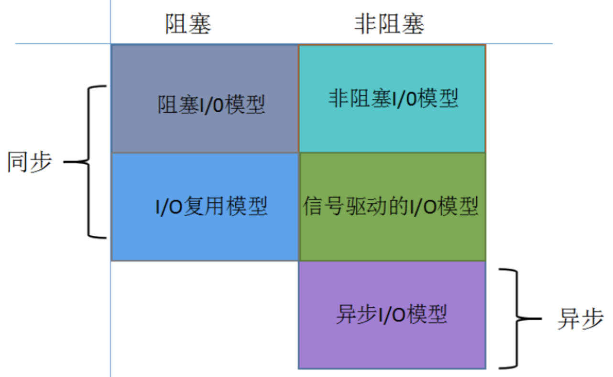
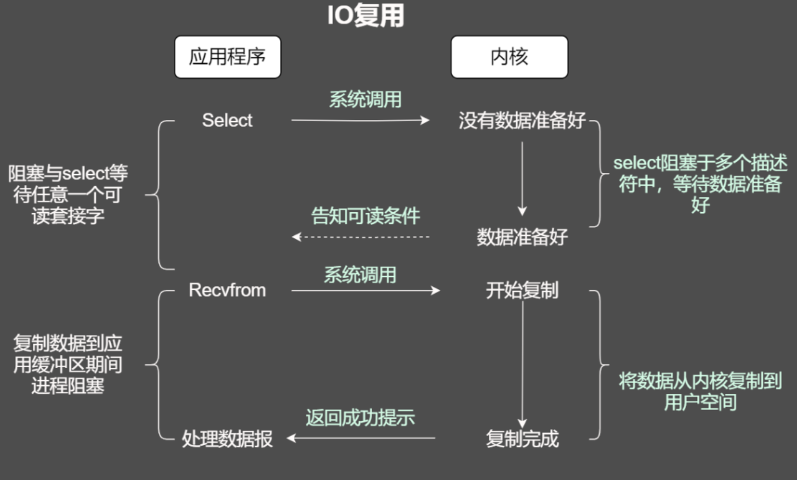

# NIO模型与Netty入门

#### Java Socket

Socket通信模型

__IP：__用于寻找通信的计算机

__端口：__用于区分跟哪个进程进行通信

__回送/回返地址：__127.x.x.x，不进行网络传输，不会出网卡

`单线程` --> `每个请求分配一个线程` --> `维护一个线程池，处理请求`

用户空间和内核空间缓冲区来回复制，影响IO性能

#### IO模型

通信模式：同步、异步

线程处理模式：阻塞、非阻塞

##### 阻塞I/O

##### 非阻塞I/O

线程轮询

##### I/O复用

- select/poll
  - 每次调用select，都需要把fd从用户态拷贝到内核态，开销比较大
  - 每次调用select，都需要遍历所有的fd，fd特别多时，开销比较大
  - select支持文件描述符太少（1024）
- epoll（Linux 2.5.44+）
  - 用户和额内核共用一块内存
  - 通过回调解决遍历问题
  - fd没有限制，支持10w+

##### 信号驱动I/O

##### 异步I/O

### Netty概览

__特点：__ 异步、事件驱动、基于NIO

__特性：__ 高吞吐、低延迟、低开销、零拷贝、可扩容、松耦合、 使用方便、可维护性好

#### 基本概念

- Channel：通道，IO操作，非阻塞
- ChannelFuture：查询操作完成情况，或阻塞当前线程等待操作完成，传递回调方法，自动执行
- Event & Handler：基于事件驱动，关联入站和出站数据流
- Encoder & Decoder：二进制流数据序列化和反序列化
- ChannelPipeline：数据处理管道