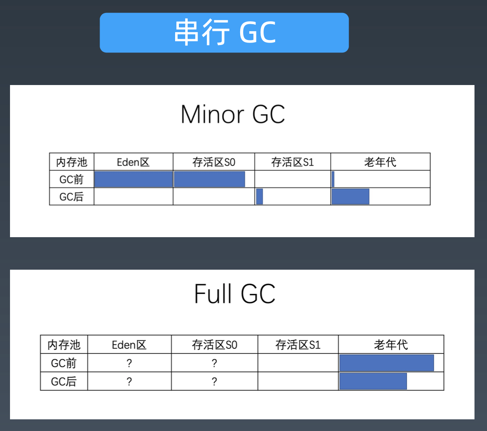

# GC日志解读和分析

#### GC日志解读和分析

```shell
# 打印Java GC日志
java -Xloggc:gc.demo.log -XX:+PrintGCDetails -XX:+PrintGCDateStamps GCLogAnalysis
```

JVM运行环境，版本参数等信息

```shell
Java HotSpot(TM) 64-Bit Server VM (25.202-b08) for bsd-amd64 JRE (1.8.0_202-b08), built on Dec 15 2018 20:16:16 by "java_re" with gcc 4.2.1 (Based on Apple Inc. build 5658) (LLVM build 2336.11.00)
Memory: 4k page, physical 16777216k(4096776k free)

/proc/meminfo:

CommandLine flags: -XX:InitialHeapSize=268435456 -XX:MaxHeapSize=4294967296 -XX:+PrintGC -XX:+PrintGCDateStamps -XX:+PrintGCDetails -XX:+PrintGCTimeStamps -XX:+UseCompressedClassPointers -XX:+UseCompressedOops -XX:+UseParallelGC
```

__Times:__  CPU使用时间，real-真正暂停时间，user-用户所用时间，sys-系统所用时间

```shell
# Young GC
2020-10-24T23:48:56.823-0800: [GC (Allocation Failure) [PSYoungGen: 262144K->74696K(550912K)] 441884K->254437K(899584K), 0.0381284 secs] [Times: user=0.05 sys=0.23, real=0.04 secs] 
2020-10-24T23:48:57.020-0800: [GC (Allocation Failure) [PSYoungGen: 550856K->107004K(594432K)] 730597K->360169K(943104K), 0.0758413 secs] [Times: user=0.11 sys=0.46, real=0.07 secs] 

# Full GC
2020-10-24T23:48:57.096-0800: [Full GC (Ergonomics) [PSYoungGen: 107004K->0K(594432K)] [ParOldGen: 253165K->268282K(462848K)] 360169K->268282K(1057280K), [Metaspace: 2706K->2706K(1056768K)], 0.0554232 secs] [Times: user=0.38 sys=0.07, real=0.06 secs]
```

#### 不同GC算法运行情况

__串行GC：__ java -XX:+UseSerialGC



__并行GC：__ java -XX:+UseParallelGC


__CMS GC：__ java -XX:+UseConcMarkSweepGC


__G1 GC：__ java -XX:+UseG1GC


#### 线程模型


__TLAB：__ 线程的内存缓冲区

#### 线程分类

- VM线程：单例的VMThread对象
- 定时任务线程：单例的WatcherThread对象
- GC线程
- 编译线程：字节码编译为本地机器码
- 信号分发线程

安全点：安全点状态，除了VM线程，其他线程都暂停（STW）

线程分析：fastthread

#### 内存分析与相关工具


一个Java对象占用多少内存？Instrumentation.getObjectSize() 调用此方法估算对象占用的空间。

__JOL__（Java Object Layout）：查看对象内存布局

#### 对象头和对象引用

 `64位JVM:` 对象头12个字节（96bit），8字节对齐，空累的实例至少占用16字节

`32位JVM:` 对象头8个字节，以4的倍数对齐

`包装类型：` 占用更多空间，Integer（4+8补齐），Long（8+8补齐）

`多维数组：` 每个嵌套数组int[dim2]都是单独一个Object，int\[dim1\]\[dim2\]尽量让dim1<dim2，减少开销

`String对象:` 有24个字节的额外开销

__对齐问题是内存浪费的根本问题__

#### OOM原因

- OutOfMemory: Java heap space
  - 超出预期的访问量/数据量
  - 内存泄露（Memory Leak）
  - 解决思路
    - 增大heap大小
    - 解决内存泄露的bug
- OutOfMemory: PermGen space/ Metaspace
  - 加载到内存中的class数量太多或体积太大
  - 解决思路
    - 增大Perm或Metaspace大小
- OutOfMemory: Unable to create new native thread
  - 创建的线程数量达到上限值
  - 解决思路
    - 调整系统参数 ulimt -a, echo120000 > /proc/sys/kernel/threads-max
    - 降低xss等参数（最大创建线程数 = 最大可用内存 / 线程栈容量）
    - 调整代码，改变线程创建和使用方式

OOM工具：Eclipse MAT, jhat

#### JVM问题分析调优经验

1. 高分配速率（High Allocation Rate），会影响程序性能

   分配速率：两次GC之间，年轻代使用量差值除以时间，MB/sec

2. 过早提升（Premature Promotion），GC暂停时长，影响吞吐量

   提示速率（Promotion Rate）：单位时间内从年轻代提升到老年代的数据量，MB/sec

   现象：

   - 短时间内频繁Full GC
   - 每次Full GC后，老年代使用率很低，在10%-20%以下
   - 提升速率接近于分配速率

   解决方法：

   - 增加年轻代的大小
   - 减少每次批处理的数量

#### 诊断分析工具 — Arthas

#### 排查方向

- 业务日志
- 系统资源和监控信息：硬件信息，CPU、内存、磁盘等，网络
- 性能指标
- 系统日志
- APM
- 排查应用系统：配置文件、内存、GC、线程、单测
- 排除资源竞争、坏邻居效应
- 疑难问题排查分析：dump线程/内存，抽样分析/调整代码、异步化

#### 压测工具： super benchmarker, apache benchmark, wrk