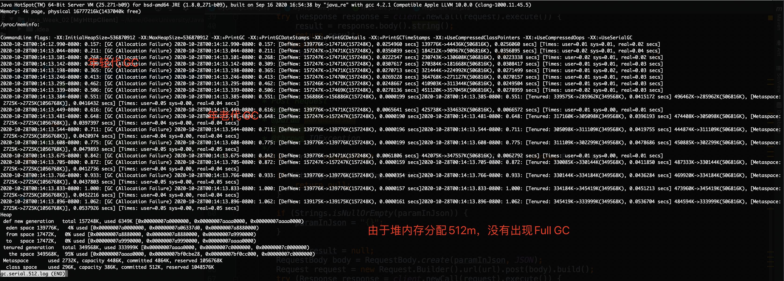

# Java 训练营第二周作业

## GC演练

### Serial

__执行指令__

```
java -XX:+UseSerialGC -Xms128m -Xmx128m -Xloggc:gc.serial.128.log -XX:+PrintGCDetails -XX:+PrintGCDateStamps GCLogAnalysis
java -XX:+UseSerialGC -Xms512m -Xmx512m -Xloggc:gc.serial.512.log -XX:+PrintGCDetails -XX:+PrintGCDateStamps GCLogAnalysis
```

__GC日志__




__GC总结__

- GC频率、是否出现OOM跟堆内存分配大小有直接关联
- 年老代GC时间明显要大于年轻代GC时间

### Parallel

__执行指令__

```
java -XX:+UseParallelGC -Xms128m -Xmx128m -Xloggc:gc.parallel.128.log -XX:+PrintGCDetails -XX:+PrintGCDateStamps GCLogAnalysis
java -XX:+UseParallelGC -Xms512m -Xmx512m -Xloggc:gc.parallel.512.log -XX:+PrintGCDetails -XX:+PrintGCDateStamps GCLogAnalysis
```

### CMS

### G1

## 压测演练

### 压测配置

- 环境：`Mac OSX 10.15.6 2.2GHz 六核 Intel Core i7 16GB`
- 工具：wrk
- 指令：`wrk -t8 -c40 -d60s --latency http://127.0.0.1:8088/api/hello`

### Serial

```
java -jar -XX:+UseSerialGC -Xms2g -Xmx2g gateway-server-0.0.1-SNAPSHOT.jar
```

__压测结果__

```
Running 1m test @ http://127.0.0.1:8088/api/hello
  8 threads and 40 connections
  Thread Stats   Avg      Stdev     Max   +/- Stdev
    Latency    13.46ms   60.14ms 693.15ms   94.73%
    Req/Sec     9.42k     2.00k   12.95k    88.81%
  Latency Distribution
     50%  452.00us
     75%  562.00us
     90%  811.00us
     99%  314.10ms
  3274000 requests in 1.00m, 390.88MB read
Requests/sec:  54492.41
Transfer/sec:      6.51MB
```

### Parallel

```
java -jar -XX:+UseParallelGC -Xms2g -Xmx2g gateway-server-0.0.1-SNAPSHOT.jar
```

__压测结果__

```
Running 1m test @ http://127.0.0.1:8088/api/hello
  8 threads and 40 connections
  Thread Stats   Avg      Stdev     Max   +/- Stdev
    Latency    13.52ms   52.62ms 448.59ms   94.25%
    Req/Sec     7.65k     2.87k   15.24k    79.85%
  Latency Distribution
     50%  490.00us
     75%  706.00us
     90%    6.14ms
     99%  299.44ms
  2876078 requests in 1.00m, 343.38MB read
Requests/sec:  47861.91
Transfer/sec:      5.71MB
```

### CMS

```
java -jar -XX:+UseConcMarkSweepGC -Xms2g -Xmx2g gateway-server-0.0.1-SNAPSHOT.jar
```

__压测结果__

```
Running 1m test @ http://127.0.0.1:8088/api/hello
  8 threads and 40 connections
  Thread Stats   Avg      Stdev     Max   +/- Stdev
    Latency    10.77ms   53.69ms 638.28ms   96.21%
    Req/Sec     7.34k     2.68k   12.61k    77.56%
  Latency Distribution
     50%  507.00us
     75%  725.00us
     90%    1.91ms
     99%  308.53ms
  2806900 requests in 1.00m, 335.12MB read
Requests/sec:  46702.94
Transfer/sec:      5.58MB
```

### G1

```
java -jar -XX:+UseG1GC -Xms2g -Xmx2g gateway-server-0.0.1-SNAPSHOT.jar
```

__压测结果__

```
Running 1m test @ http://127.0.0.1:8088/api/hello
  8 threads and 40 connections
  Thread Stats   Avg      Stdev     Max   +/- Stdev
    Latency    18.36ms   74.45ms 789.52ms   94.03%
    Req/Sec     7.35k     2.53k   12.73k    81.59%
  Latency Distribution
     50%  521.00us
     75%  780.00us
     90%    4.45ms
     99%  398.95ms
  2845056 requests in 1.00m, 339.67MB read
Requests/sec:  47350.87
Transfer/sec:      5.65MB
```

