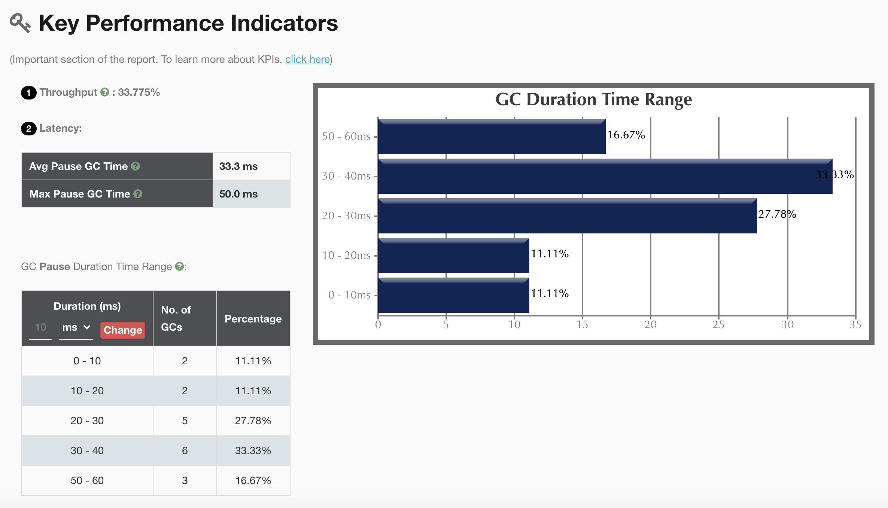
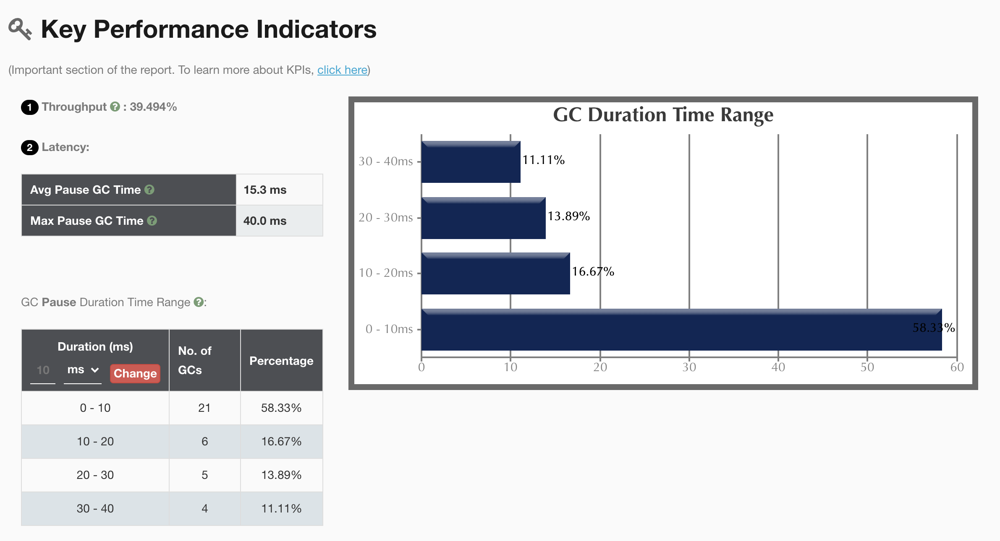
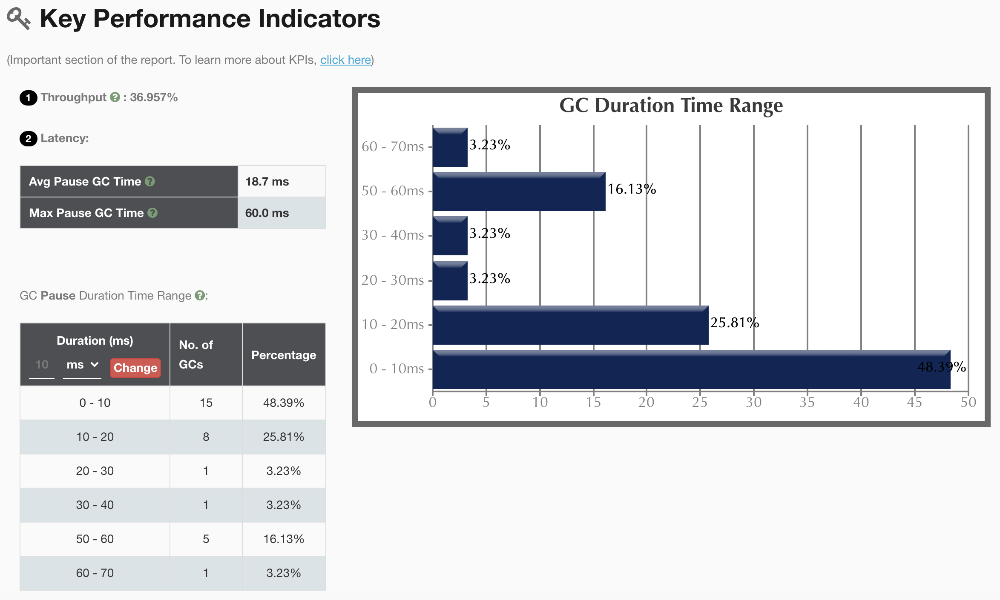
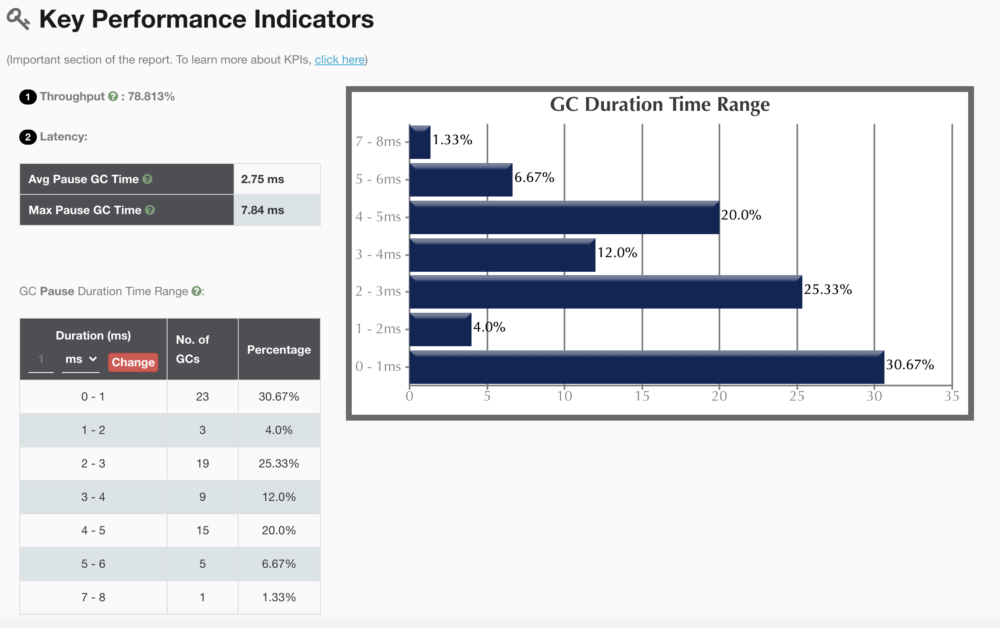

# Java 训练营第二周作业

## GC演练

### Serial

__执行指令__

```
java -XX:+UseSerialGC -Xms128m -Xmx128m -Xloggc:gc.serial.128.log -XX:+PrintGCDetails -XX:+PrintGCDateStamps GCLogAnalysis
java -XX:+UseSerialGC -Xms512m -Xmx512m -Xloggc:gc.serial.512.log -XX:+PrintGCDetails -XX:+PrintGCDateStamps GCLogAnalysis
```



### Parallel

```
java -XX:+UseParallelGC -Xms128m -Xmx128m -Xloggc:gc.parallel.128.log -XX:+PrintGCDetails -XX:+PrintGCDateStamps GCLogAnalysis
java -XX:+UseParallelGC -Xms512m -Xmx512m -Xloggc:gc.parallel.512.log -XX:+PrintGCDetails -XX:+PrintGCDateStamps GCLogAnalysis
```



### CMS

```
java -XX:+UseConcMarkSweepGC -Xms128m -Xmx128m -Xloggc:gc.cms.128.log -XX:+PrintGC -XX:+PrintGCDateStamps GCLogAnalysis
java -XX:+UseConcMarkSweepGC -Xms512m -Xmx512m -Xloggc:gc.cms.512.log -XX:+PrintGC -XX:+PrintGCDateStamps GCLogAnalysis
```



### G1

```
java -XX:+UseG1GC -Xms128m -Xmx128m -Xloggc:gc.g1.128.log -XX:+PrintGC -XX:+PrintGCDateStamps GCLogAnalysis
java -XX:+UseG1GC -Xms512m -Xmx512m -Xloggc:gc.g1.512.log -XX:+PrintGC -XX:+PrintGCDateStamps GCLogAnalysis
```



### 总结

- 堆大小为128m时，所有GC算法，执行程序都会OOM，堆大小根本上影响到服务的性能
- 堆大小为512m时，G1算法的，吞吐量最大，平均延迟最低
- Serial GC在众多算法中，平均延迟是最高的，充分体现单线程GC耗时的局限性


## 压测演练

### 压测配置

- 环境：`Mac OSX 10.15.6 2.2GHz 六核 Intel Core i7 16GB JDK1.8.0_271-b09`
- 工具：wrk
- 指令：`wrk -t100 -c200 -d60s --latency http://127.0.0.1:8088/api/hello`（100个线程，200个连接，执行60s）

### Serial

```
java -jar -XX:+UseSerialGC -Xms4g -Xmx4g gateway-server-0.0.1-SNAPSHOT.jar
```

__压测结果__

```
Running 1m test @ http://127.0.0.1:8088/api/hello
  100 threads and 200 connections
  Thread Stats   Avg      Stdev     Max   +/- Stdev
    Latency    38.02ms   96.20ms 687.28ms   89.95%
    Req/Sec   495.29    189.24     1.59k    71.82%
  Latency Distribution
     50%    3.49ms
     75%    6.68ms
     90%  135.29ms
     99%  482.97ms
  2635963 requests in 1.00m, 314.71MB read
  Socket errors: connect 0, read 7, write 0, timeout 0
Requests/sec:  43860.84
Transfer/sec:      5.24MB
```

### Parallel

```
java -jar -XX:+UseParallelGC -Xms4g -Xmx4g gateway-server-0.0.1-SNAPSHOT.jar
```

__压测结果__

```
Running 1m test @ http://127.0.0.1:8088/api/hello
  100 threads and 200 connections
  Thread Stats   Avg      Stdev     Max   +/- Stdev
    Latency    26.39ms   67.24ms   1.27s    90.63%
    Req/Sec   438.86    212.05     5.38k    68.38%
  Latency Distribution
     50%    3.57ms
     75%    7.13ms
     90%   84.97ms
     99%  342.83ms
  2087200 requests in 1.00m, 249.19MB read
  Socket errors: connect 0, read 223, write 0, timeout 0
Requests/sec:  34725.44
Transfer/sec:      4.15MB
```

### CMS

```
java -jar -XX:+UseConcMarkSweepGC -Xms4g -Xmx4g gateway-server-0.0.1-SNAPSHOT.jar
```

__压测结果__

```
Running 1m test @ http://127.0.0.1:8088/api/hello
  100 threads and 200 connections
  Thread Stats   Avg      Stdev     Max   +/- Stdev
    Latency    29.97ms   74.43ms 695.68ms   90.28%
    Req/Sec   438.41    197.79     1.75k    66.11%
  Latency Distribution
     50%    3.65ms
     75%    8.51ms
     90%  100.26ms
     99%  368.15ms
  2423353 requests in 1.00m, 289.32MB read
  Socket errors: connect 0, read 45, write 0, timeout 0
Requests/sec:  40321.67
Transfer/sec:      4.81MB
```

### G1

```
java -jar -XX:+UseG1GC -Xms4g -Xmx4g gateway-server-0.0.1-SNAPSHOT.jar
```

__压测结果__

```
Running 1m test @ http://127.0.0.1:8088/api/hello
  100 threads and 200 connections
  Thread Stats   Avg      Stdev     Max   +/- Stdev
    Latency    35.86ms   88.76ms 920.45ms   90.18%
    Req/Sec   434.50    189.13     1.69k    67.29%
  Latency Distribution
     50%    3.83ms
     75%    9.01ms
     90%  121.42ms
     99%  452.23ms
  2361232 requests in 1.00m, 281.91MB read
  Socket errors: connect 0, read 33, write 1, timeout 0
Requests/sec:  39286.18
Transfer/sec:      4.69MB
```

### 结论

- 处理请求个数，最多：Serial，最少：Parallel
- 平均延迟，最高：Serial，最低：Parallel
- Serial GC，平均延迟明显要大于其他GC算法，但吞吐量较高
- Parallel GC，虽然延迟要低，但吞吐量较差，甚至出现较多的Socket错误
- 从平均耗时和吞吐量总体来看，在当前配置下，CMS GC综合表现更优一些
- G1 GC可能由于堆大小限制，并没有发挥较好的优势

