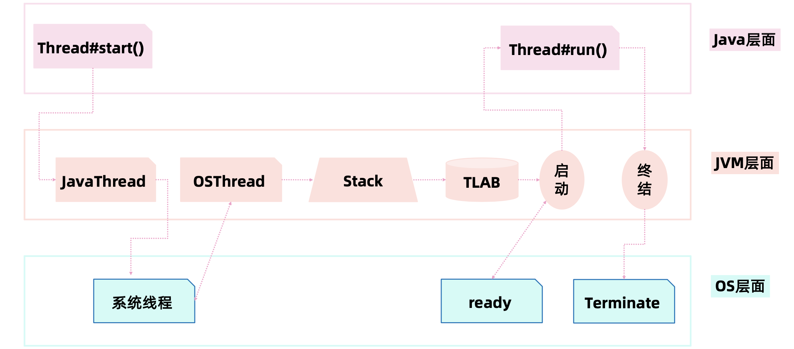
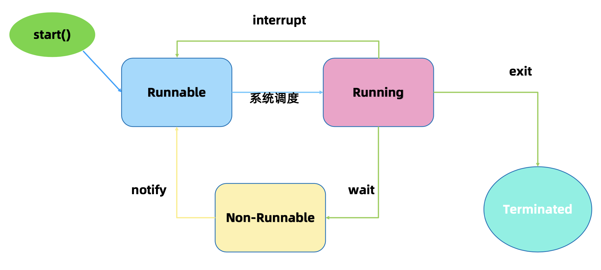
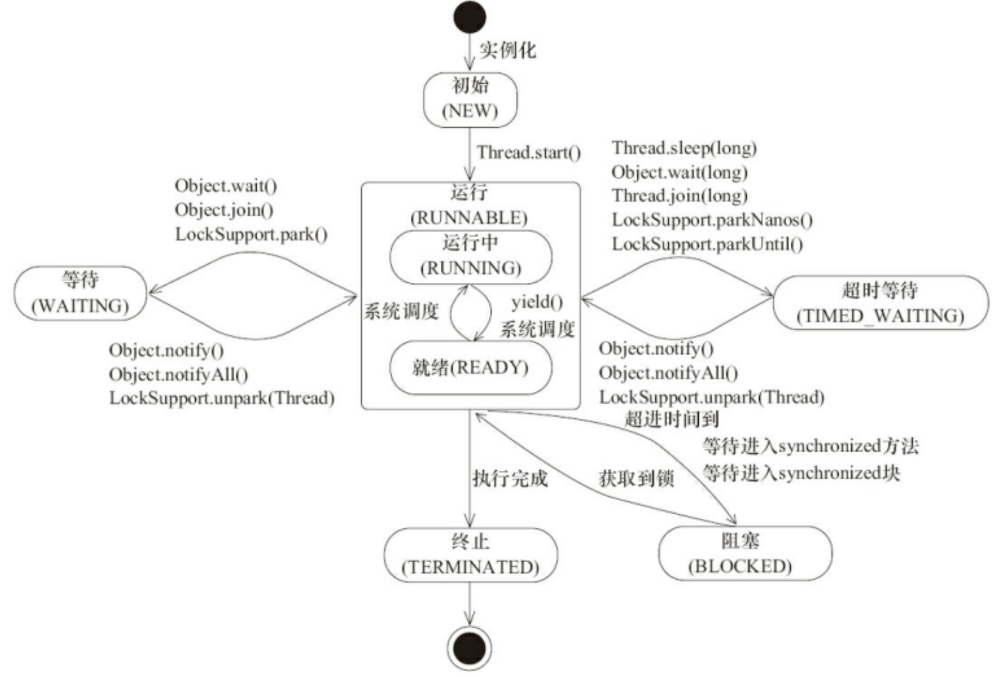
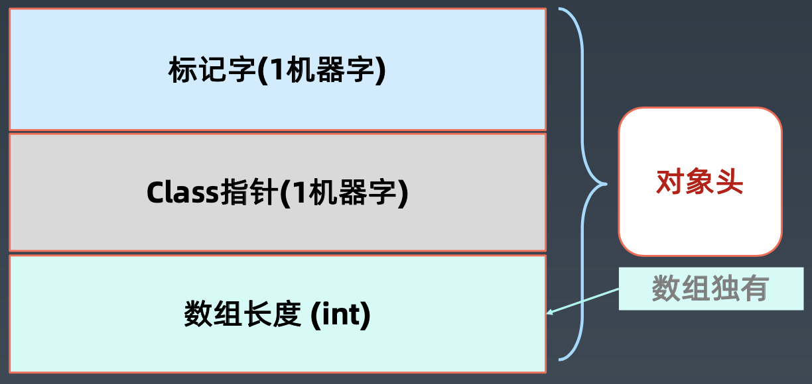

# Java并发编程

### Java的线程创建过程

### Java的线程状态

- N 初始
- RR 运行RUNNABLE（RUNNING, READY）
- WW（WAITING等待, TIME_WAITING超时等待）
- B（BLOCKED）
- T（TERMINATED）

### Thread类

__重要属性：__

- name  线程
- daemon  后台守护进程标志

__重要方法：__

- start()  启动新进程并自动执行
- join()  等待进程执行完毕，进入`Runnable`状态，不释放已经持有的对象锁，但释放线程实例持有锁
- currentThread()  获取当前线程信息
- sleep()  线程睡眠，`不释放锁，释放cpu占用`
- wait()  放弃锁，等待时间自动唤醒，进入等待队列
- notify() / notifyAll()  随机唤醒一个线程 / 唤醒所有线程
- yield()  让线程从`Running`状态恢复到`Runnable`状态，放弃获取的CPU时间片，不放弃锁资源

### Thread的中断和异常处理

- 线程内部处理异常，不移除到外层
- 线程被wait/join/sleep阻塞后，调用线程的interrupt方法，那线程将抛出InterruptedException中断异常

### 并发性质

- 原子性：对基本数据类型的变量的读取和赋值操作是原子性操作，不可中断
- 可见性：volatile关键词，修改后立即更新到主存，不能保证原子性；synchronized和Lock同样可以保证可见性
- 有序性：Java允许编译器和处理器对指令进行重排，可能会影响到多线程执行，volatile/(sychronized Lock)

### synchronized

__实现：__

- 对象头标记字
- synchronized方法优化
- 偏向锁：BiaseLock

__用法：__

- 方法
- 方法块

### volatile

- 强制从主内存刷数据
- 适用场景：单线程写，多线程读
- 原则：能不用就不用，不确定的时候也不要用
- 替代方案：Atomic原子类

### final

- final class： 不能继承
- final method： 不允许Override
- final 局部变量： 不允许修改
- final 实例属性：初始化不能修改，只能赋值一次，线程安全
- final static属性：静态块执行后不允许修改，只能赋值一次