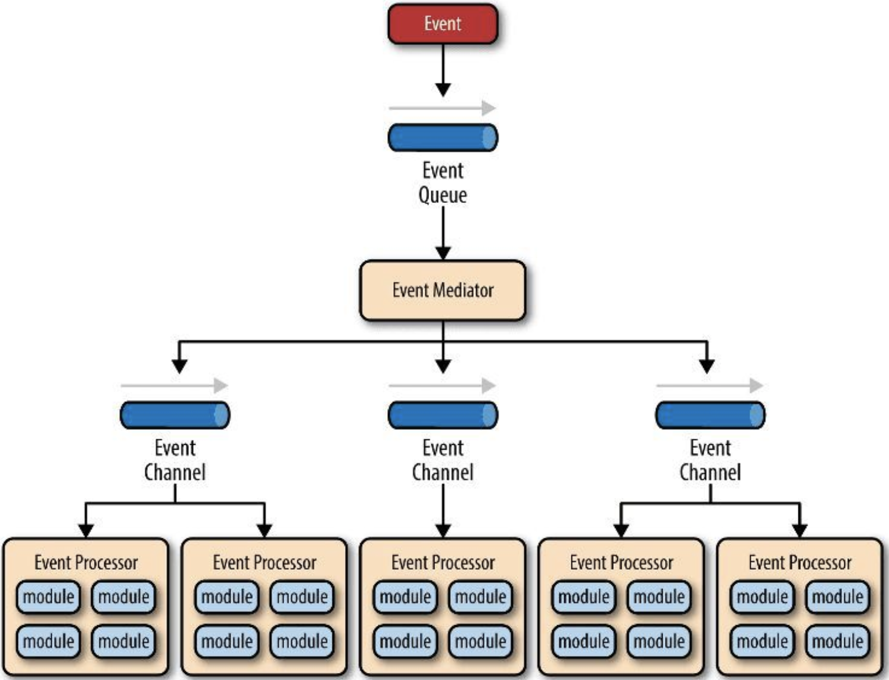
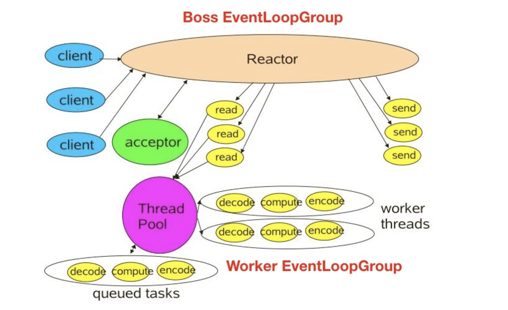
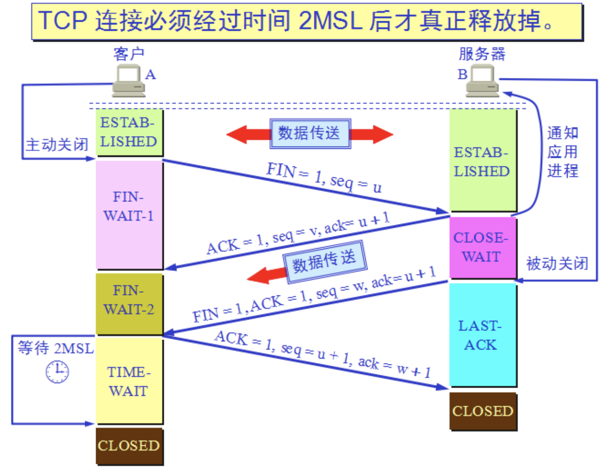

# Netty原理与API网关

### 高性能

- 高并发用户（Concurrent Users）
- 高吞吐量（Throughout）
- 低延迟（Latency）

### 指标

吞吐量

- QPS（Query per Second）每秒查询率

- TPS（Transaction per Second）每秒事务率

耗时

- Latency：用户收到响应时间 - 用户发起请求时间（包含网络耗时）
- RT（Response time）：请求出系统时间 - 请求进系统时间（服务耗时）

### 稳定性建设（混沌工程）

- 容量
- 爆炸半径
- 工程方面积累与改进

## Netty 原理

### 核心概念（BECH）

- B（Bootstrap）
- E（EventLoop）
- C（Channel）
- H（Handler）

### 事件处理机制

### Reactor模型

### Netty NIO

## 网络程序优化

### 粘包和拆包

ByteToMessageDecoder

- FixedLengthFrameDecoder 定长解码协议，指定报文长度
- LineBasedFrameDecoder 行分隔解码器，\n或\r\n
- DelimiterBasedFrameDecoder 自定义分隔符
- LengthFieldBasedFrameDecoder 长度编码 解码器，分成报文头/报文体
- JsonObjectDecoder json格式解码器

### Nagle与TCP_NODELAY

分段传输、缓冲区满、达到超时

- MTU（Maxitum Transmission Unit）最大传输单元：1500Byte（http和ip头各占20Byte）
- MSS（Maxitum Segment Size）最大分段：1460Byte

### 连接优化

三次握手

四次挥手

TIME-WAIT：2MSL，等待两个周期后，才真正关闭连接

__Netty 优化__

- 不要阻塞EventLoop
- 系统参数优化  ulimit -a /proc/sys/net/ipv4/tcp_fin_timeout（linux） TcpTimedWaitDelay（windows）
- 缓冲区优化 SO_RCVBUF/SO_SNDBUF/SO_BACKLOG/ REUSEXXX
- 心跳频率周期优化：心跳机制和断线重连
- 内存与 ByteBuffer优化
  - DirectBuffer 减少内核态和用户态的数据互相copy
  - HeapBuffer
- 其他
  - ioRatio cpu对io和非io的使用比率
  - Watermark 缓冲区水位
  - TrafficShaping 水位流控

## 网关

### 四大职能

### 分类

- __流量网关__
  - 全局性流控
  - 日志统计
  - 防止SQL注入
  - 防止Web攻击
  - 屏蔽工具扫描
  - 黑白IP名单
  - 证书/加解密处理
- __业务网关__
  - 服务级别的流控
  - 服务降级和熔断
  - 路由与负载均衡
  - 灰度策略
  - 服务过滤、聚合与发现
  - 权限验证与用户等级策略
  - 业务规则与参数校验
  - 多级缓存策略