# Java 相关框架

## Spring

### Spring framework 6大模块

前四个模块为常用模块

- Core：Bean/Context/AOP
- Testing：Mock/TestContext
- DataAccess：Tx/JDBC/ORM
- Spring MVC/WebFlux：web
- Integration：remoting/JMS/WS
- Languages：Kotlin/Groovy

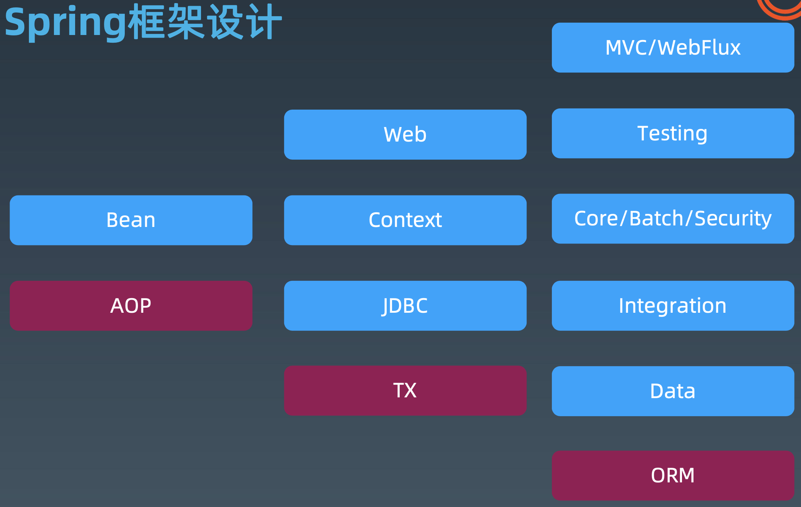

### Spring AOP

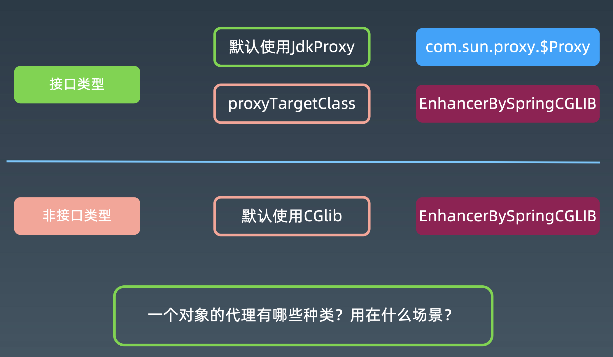

- 有接口的类，默认使用Jdk的动态代理，如果设置ProxyTargetClass=true则走cglib
- 无接口的类，使用cglib进行代理
- `context.getBeanDefinitionNames()`获取所有已加载的bean名称

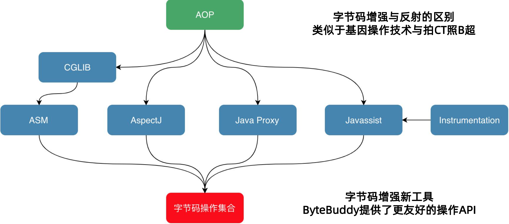

### Spring IoC

什么类型的循环依赖Spring无法处理？

A类的构造方法依赖B类，B类的构造方法同时也依赖A类

### Spring Bean生命周期

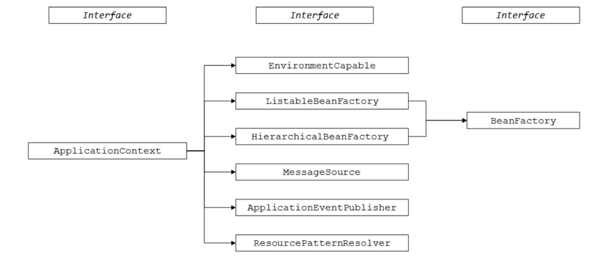

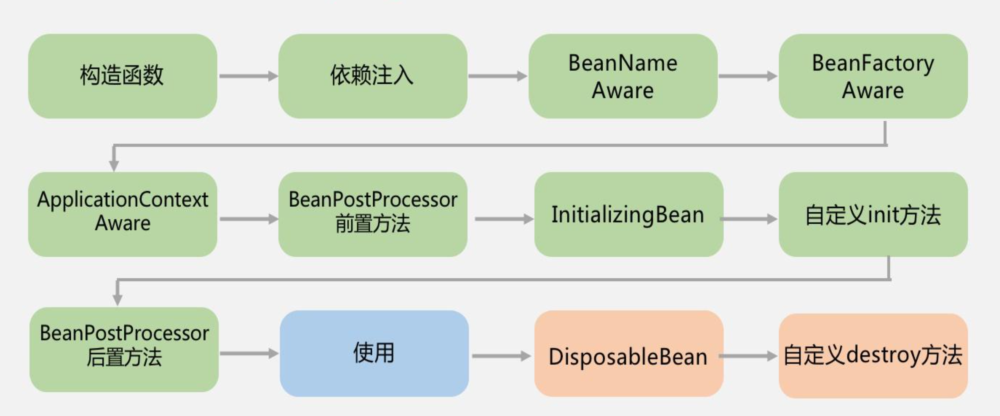

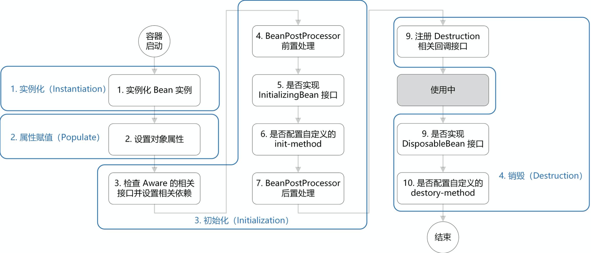

### Spring XML配置原理

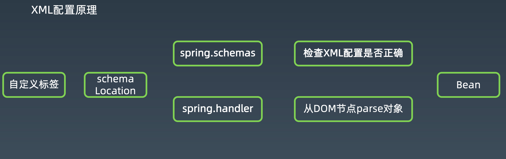

自动化XML配置工具：XmlBeans -> Spring-xbean

#### Spring配置演进

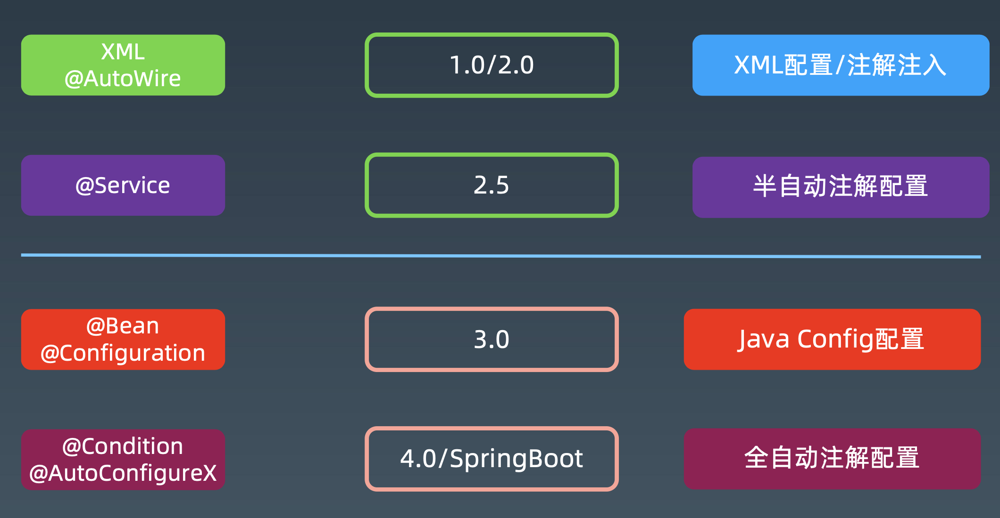

### Spring Messaging

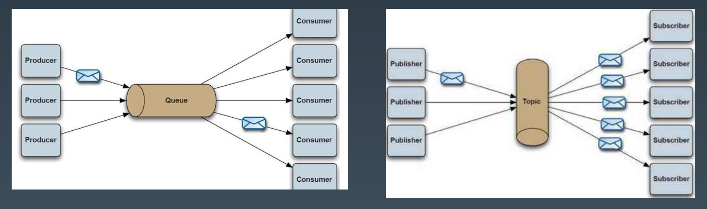

JMS

- 点对点通讯
- 发布/订阅

### Spring Boot

快速构建Maven/Gradle依赖管理的Spring Boot项目：https://start.spring.io

#### Spring Boot核心原理

- 自动化配置：简化配置核心，基于Configuration、EnableXXX、Condition
- spring-boot-starter：脚手架核心，整合各种第三方类库、协同工具

#### 自动化配置原理

- @EnableAutoConfiguration
- src/main/resources/META-INF/spring.factories 定义自动加载配置

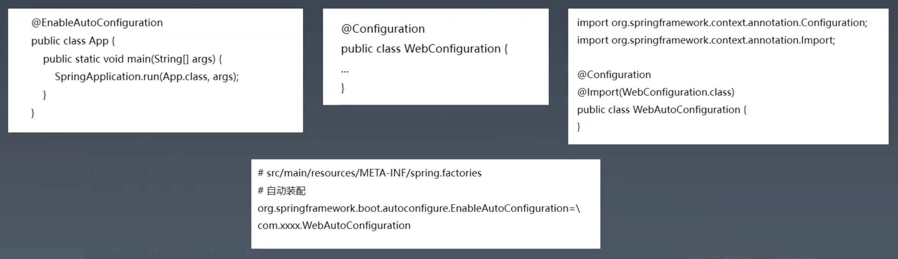

#### Spring Starter

- spring.provides
- spring.factories
- additional-metadata
- 自定义Configuration类

### JDBC

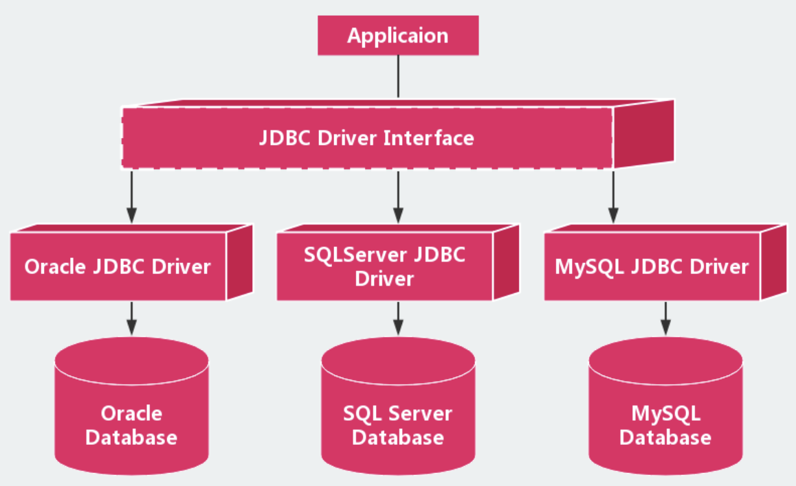

- DirverManager
- Connection
- Statement
- ResultSet
- DataSource Pool

### Hibernate & MyBatis

最大区别是：对DBA可见，一般用MyBatis，SQL可控

### JPA

Java Persistence API